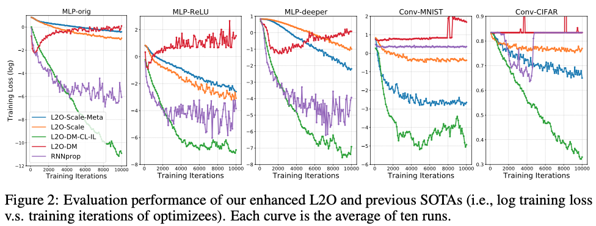
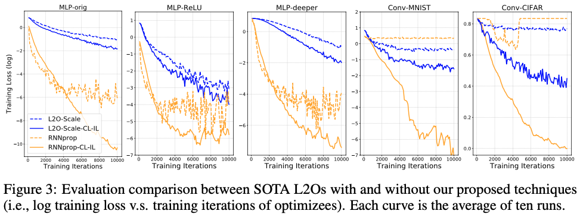
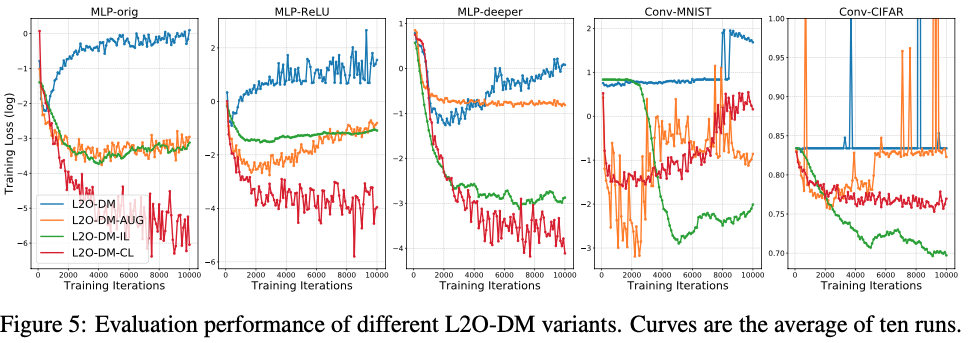
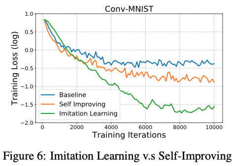

# Training Stronger Baselines for Learning to Optimize

[](https://opensource.org/licenses/MIT)

Code for this paper [Training Stronger Baselines for Learning to Optimize]().

Tianlong Chen, Weiyi Zhang, Jingyang Zhou, Shiyu Chang, Sijia Liu, Lisa Amini, Zhangyang Wang


## Overview

With many efforts devoted to designing more sophisticated **L2O models**, we argue for another orthogonal, under-explored theme: the **training techniques** for those L2O models. We show that even **the simplest L2O model could have been trained much better**.

- **Curriculum Learning**

  We first present a progressive training scheme to gradually increase the optimizer unroll length, to mitigate a well-known L2O dilemma of truncation bias (shorter unrolling) versus gradient explosion (longer unrolling).

- **Imitation Learning**

  We further leverage off-policy imitation learning to guide the L2O learning , by taking reference to the behavior of analytical optimizers. 

Our improved training techniques are plugged into a variety of state-of-the-art L2O models, and immediately boost their performance, **without making any change to their model structures.** 


## Experiment Results

### Training the L2O-DM baseline to surpass the state-of-the-art



### Training state-of-the-art L2O models to boost more performance



### Ablation study of our proposed techniques



### Imitation Learning v.s. Self-Improving




## Reproduce Details

Experimental details on L2O-DM and RNNProp are refer to this [README](https://github.com/Tianlong-Chen/L2O-Training-Techniques/blob/master/L2O-DM%20%26%20RNNProp/README.md).

Experimental details on L2O-Scale are refer to this [README](https://github.com/Tianlong-Chen/L2O-Training-Techniques/blob/master/L2O-Scale/README.md).

## Citation

If you use this code for your research, please cite our paper:

```

```

